# Attendance Manager

#### Technologies:

- Java
- JavaFX

## Table of Contents

- [About](#about)
- [Implementation](#implementation)
- [Demo](#demo)
- [Author Info](#author-info)

## About

> A Java application that allows teachers to take and view attendance. Teachers also have the ability to add/remove classes, add/remove students, and see which students have more than 10 absences. To use the application, import it into an IDE and run the AttendanceGUI.java file.

## Implementation

Techniques Used:
- Sorting via a Comparator
- Arrays
- Loops
- File Input/Output
- Polymorphism
- Error Handling
- Graphical User Interface
- Linear Search
- Linked List
- Queue Implemented as a Linked List

NetBeans and JavaFX was used to create the graphical user interface.

## Demo

Visual demo of the application

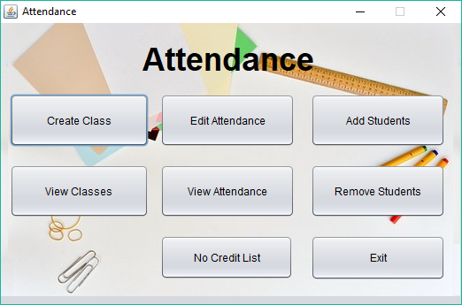
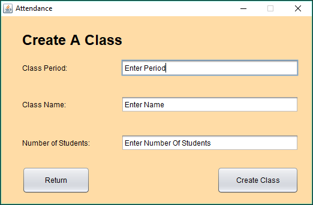
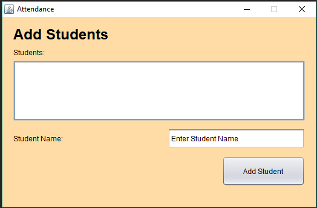
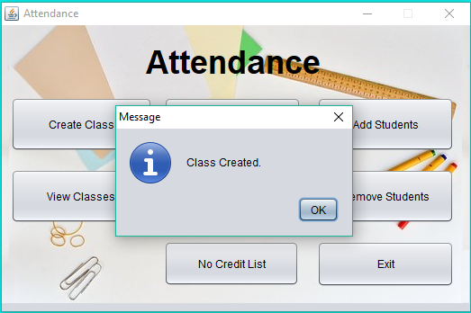
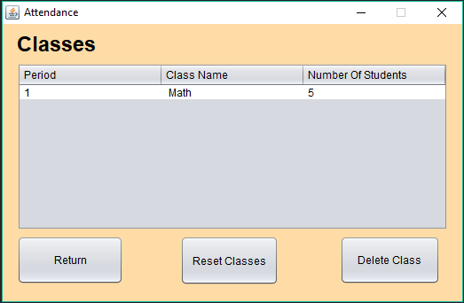
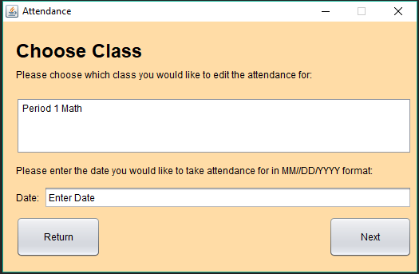
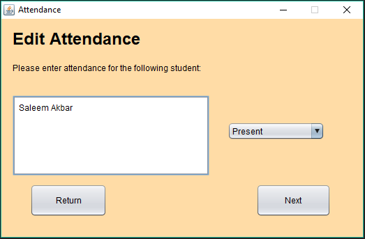
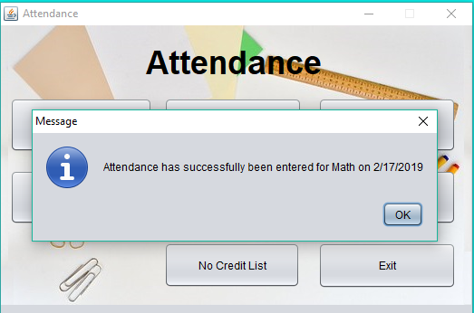
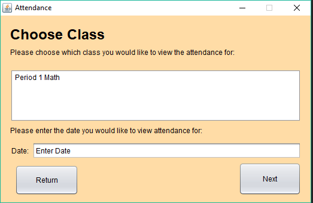
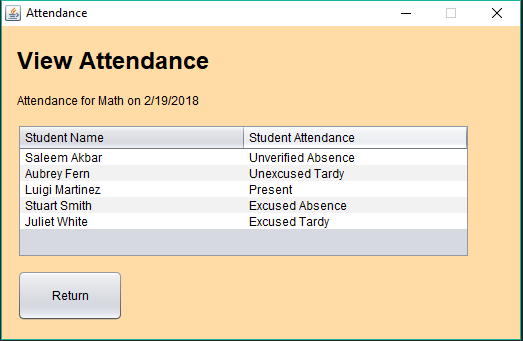
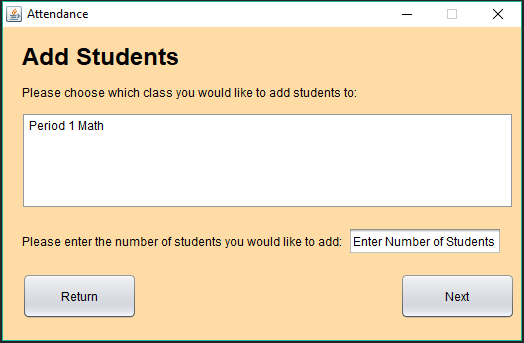

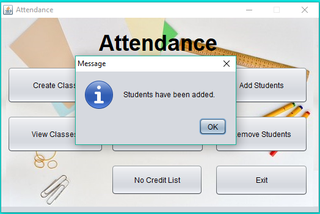
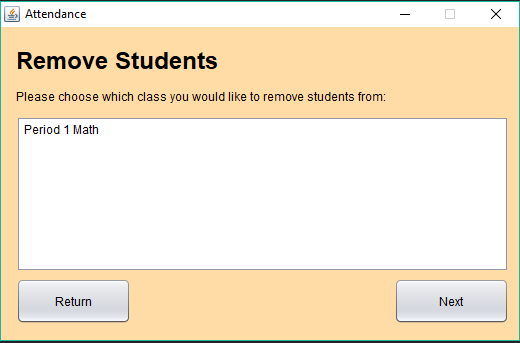
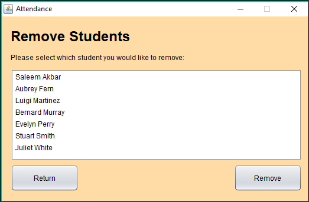
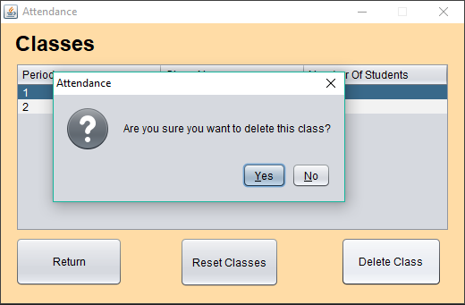
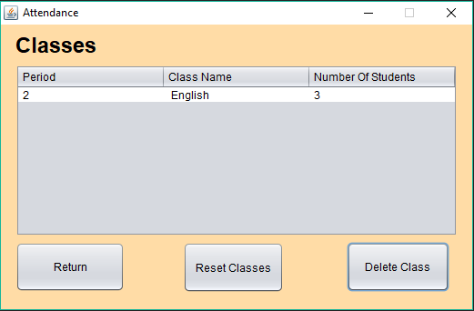
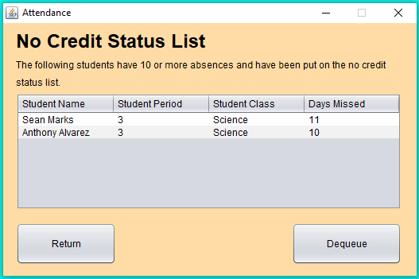
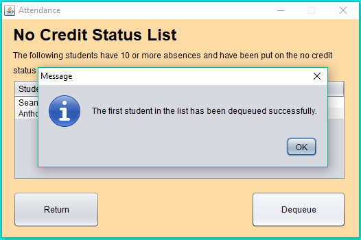

## Author Info

- LinkedIn - Moeez Sohail (https://www.linkedin.com/in/moeezsohail/)